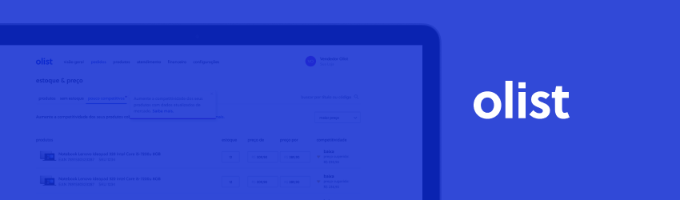

# Análise de dados com python e SQL

O projeto visa explorar dados da Olist, uma plataforma de e-commerce que atua como um facilitador para os vendedores se conectarem a diferentes marketplaces, como Mercado Livre, Submarino, Shoptime, etc. A análise dos dados foi feita por meio de consultas com SQL e Python.

Os dados foram extraídos do [Kaggle](https://www.kaggle.com/datasets/olistbr/brazilian-ecommerce), transformados e tratados com o pandas, carregados em um arquivo .db em tabelas com o sqlite3 e convertidos em dataframe para a manipulação dos dados e elaboração de gráficos (Pandas e Seaborn).

# Ferramentas e métodos:
- Jupyter notebook
- ETL
- Git/GitHub
- Linguagem Python
- Consultas SQL
- Criação de um arquivo de banco de dados por meio do sqlite3
- Transformação  e manipulação de dados (Pandas/SQL)
- Elaboração de hipóteses/consultas
- Elaboração de gráficos com o seaborn

# Lista de consultas

1. Total de estados registrados
2. Quantidade de cidades por estado
3. Total de produtos cadastrados
4. Número de pedidos por estado
5. Top 10 cidades com mais pedidos em Minas Gerais e São Paulo
6. Categorias de produto que mais venderam em Minas Gerais e São Paulo
7. Quantidade de vendedores por estado
8. Quantidade de pedidos por status de pedido
9. Quantidade de pedidos entregues e quantidade de pedidos cancelados
10. Quantidade de pedidos por tipo de pagamento
11. Preço máximo, mínimo e médio dos valores de pedidos feitos com cartão de crédito
12. Média do frete por categoria do produto
13. Total de pedidos cadastrados
14. Distribuição de reviews dos pedidos
15. Ano em que mais enviou produtos.

Clique [aqui](https://github.com/deborabmfreitas/projeto-sql) para visualizar mais detalhes do projeto. :)